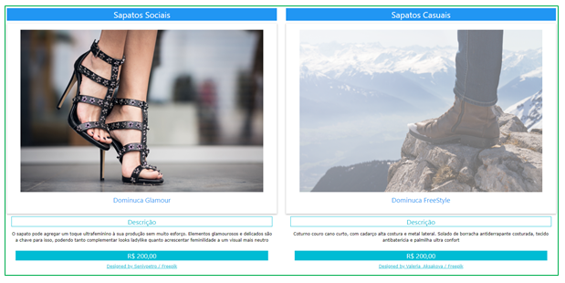

<h2> Agenda 14: FRAMEWORK W3.CSS</h2>

Disciplina Desenvolvimento de Sistemas I

EaDTEC - Centro Paula Souza

## 🗨 Enunciado:

Criar um site com fotos e informações sobre atrativos turísticos da cidade em que mora.

### Para este projeto, seguir as seguintes solicitações:

1. No título (aba) da página Atrativos Turísticos - NOME DA CIDADE

2. No corpo da página:

Deverá ser dividido em colunas com no mínimo seis atrativos turísticos da cidade.

### Atenção:

Fique atento para colocar o link correto das imagens na codificação da página e, caso a opção seja usar as imagens localmente no dispositivo, você deve criar uma pasta  contendo o arquivo HTML da atividade e as devidas imagens. ENVIAR ESSA PASTA COMPACTADA.

### Dicas:

- Colocar título da página nas entre a tag &lt;title&gt; e &lt;/title&gt;;
- Usar a tag &lt;h2&gt; para título de cada coluna/linha; 
- Colocar a imagem dos atrativos turísticos na mesma pasta do arquivo html ou criar uma pasta apenas para imagens;
- Pesquisar links interessantes para achar fotos de atrativos turísticos; 
- Para os efeitos utilizar w3-hover-opacity ou acesse o [link](https://www.w3schools.com/w3css/w3css_animate.asp) e veja mais tipos de animações.

Obs.: Não esqueça de colocar a referência das fotos.

### Exemplo: 

Segue abaixo um exemplo para demonstrar a divisão de colunas do layout de uma imagem.

